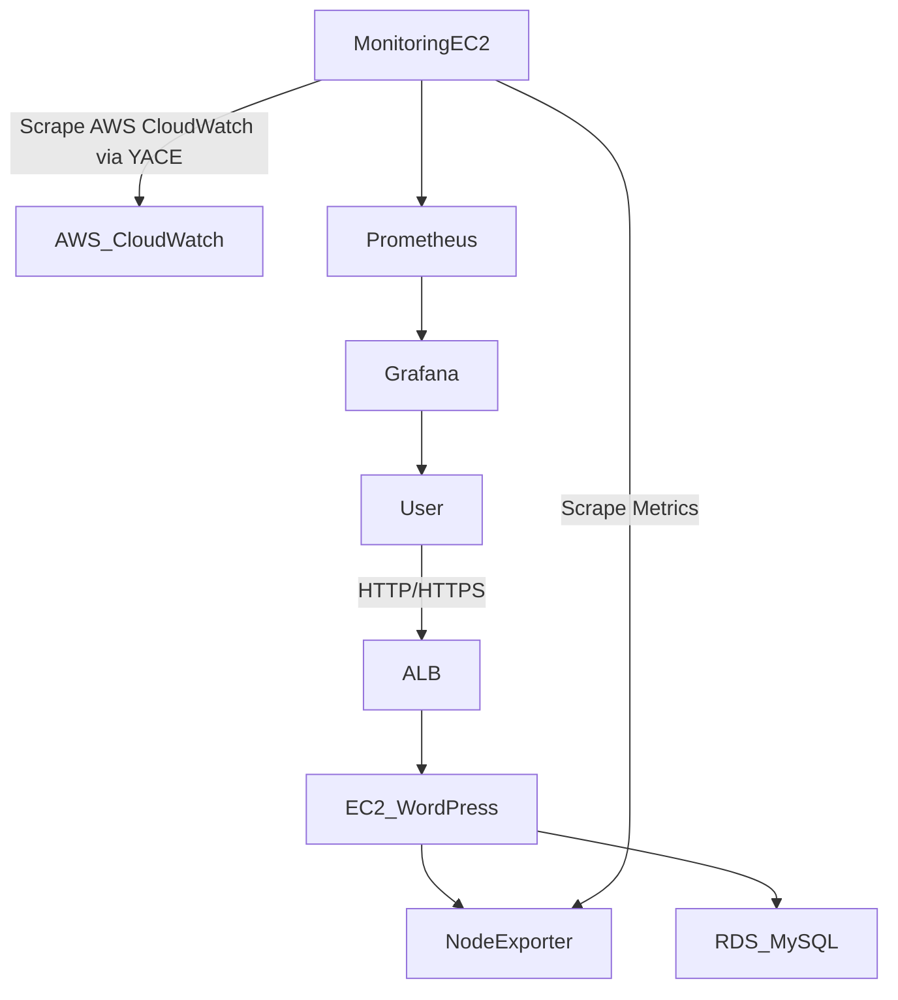

# Fully Automated AWS WordPress Monitoring Stack  
### Terraform | AWS | Prometheus | Grafana | EC2 | RDS


---

## 🚀 Overview

This project automates the deployment of a secure, production-ready **WordPress application** with a fully integrated monitoring stack using **Terraform** on AWS.

It provisions:

- EC2 for WordPress
- Amazon RDS (MySQL)
- Prometheus & Node Exporter
- Grafana dashboards
- VPC networking, subnets & security groups

This solves the real-world need for **repeatable, secure infrastructure deployment with observability and zero manual configuration.**

---

## 🏗 Architecture


## 🎯 Key Features

The following features are implemented to ensure security, observability, and ease of deployment:

* **Fully automated AWS deployment using Terraform**
* **Private RDS database** (Deployed in a private subnet, not publicly accessible)
* **Secure networking** with isolated public/private subnets
* **WordPress installed and configured** automatically on launch via User Data
* **Prometheus integration** scrapes EC2, WordPress, and CloudWatch metrics
* **Grafana dashboards** pre-loaded with CPU, memory, RDS, and WP instance metrics
* **Scalable and reusable IaC design** utilizing modular Terraform structures

## 🛠 Tech Stack

| Category | Tools |
| :--- | :--- |
| **IaC** | Terraform |
| **Cloud** | AWS (EC2, RDS, VPC, IAM, Subnets, SGs) |
| **OS** | Amazon Linux 2 |
| **Application** | WordPress (PHP, Apache2) |
| **Monitoring** | Prometheus, Node Exporter, Grafana, YACE |
| **Version Control** | Git & GitHub |

---

## 📁 Repository Structure

```text
📦 wordpress-rds-monitoring
├── main.tf                 # Main configuration entry point
├── variables.tf            # Input variables definition
├── outputs.tf              # Output values (URLs, IPs)
├── modules/                # Reusable Terraform modules
│   ├── network/            # VPC, Subnets, Internet Gateway
│   ├── security/           # Security Groups and Rules
│   ├── rds_mysql/          # RDS instance configuration
│   ├── wordpress_ec2/      # WordPress instance & User Data
│   └── monitoring_ec2/     # Prometheus/Grafana instance
└── README.md               # Project documentation
```
## ⚙ Setup Instructions (Run Locally)

Follow these steps to deploy the infrastructure from your local machine.

---

### 1️⃣ Clone Repository

```bash
git clone https://github.com/yadupalchaudhary0/minor-project.git
cd wordpress-rds-monitoring
```
### 2️⃣ Configure AWS Credentials

Make sure your AWS CLI is configured with the correct access key, secret key, and region.

```bash
aws configure
```
AWS CLI reference:
https://docs.aws.amazon.com/cli/latest/userguide/cli-configure-quickstart.html

### 3️⃣ Initialize Terraform
Run the following commands to initialize Terraform, preview changes, and deploy the infrastructure.
```bash
terraform init
terraform plan
terraform apply -auto-approve
```
Terraform documentation: https://developer.hashicorp.com/terraform/docs/cli
### 4️⃣ Access Outputs

Once the deployment is complete, Terraform will display the following outputs:

- **WordPress Public URL**
- **Prometheus Server URL**
- **Grafana URL**


## 📊 Monitoring Dashboards

| Metric Source | Included |
|--------------|----------|
| Node Exporter | ✅ |
| CloudWatch RDS Metrics (via YACE) | ✅ |
| Custom Grafana Dashboard | ✅ |
| Real-Time Alerts (optional future feature) | ⏳ |

---
## 📷 Preview Screenshots

### 🟢 WordPress Running


---

### 📊 Grafana Dashboard


---

### 🎯 Prometheus Targets


---

## 🤝 Contributing

Contributions are welcome.

1. Fork this repository  
2. Create a new feature branch  
3. Submit a pull request  

---

## 📄 License

This project is licensed under the **MIT License**.

MIT License reference:  
https://opensource.org/licenses/MIT

---

## 👤 Author

**Abhay Kumar Saini**

🔹 GitHub: https://yadupalchaudhary0
🔹 LinkedIn: https://www.linkedin.com/in/chaudhary-yadupal-singh-4127b5263


---

## 🎥 Demo Video


https://github.com/user-attachments/assets/d879b8f7-69a6-44ff-8bc6-2bf076ff51e4


